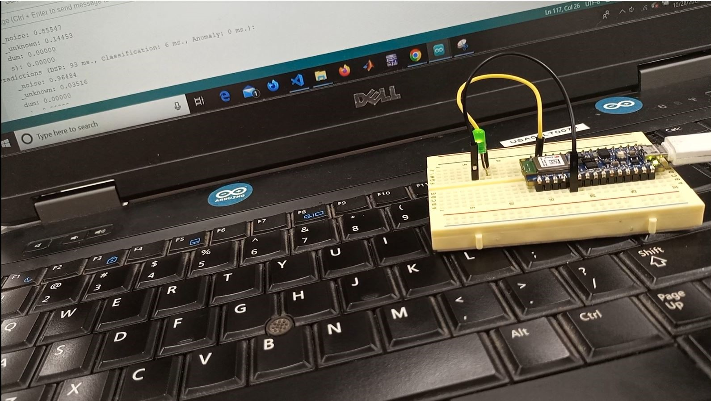
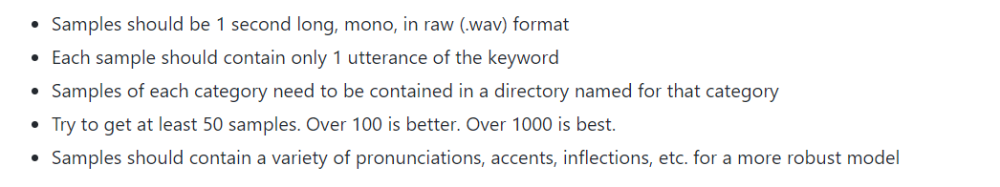
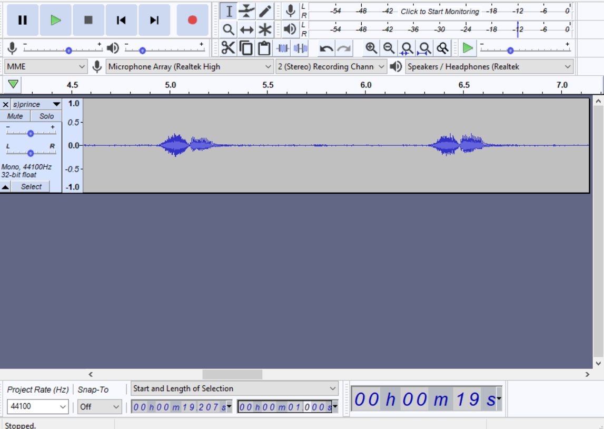
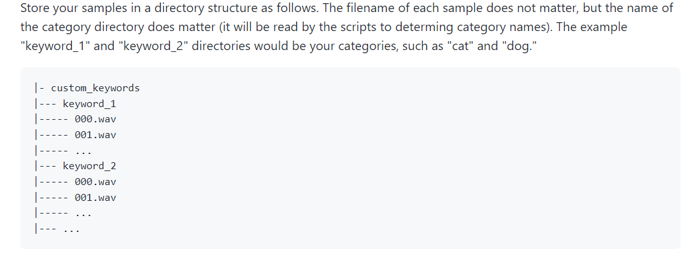
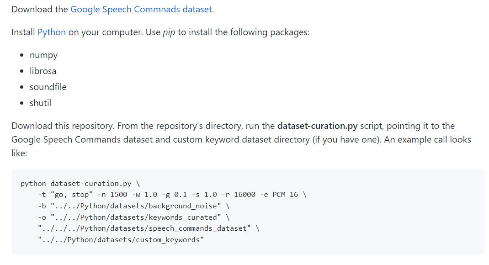
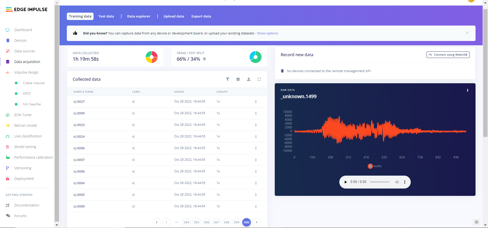
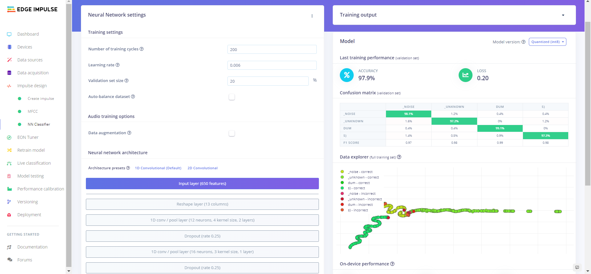
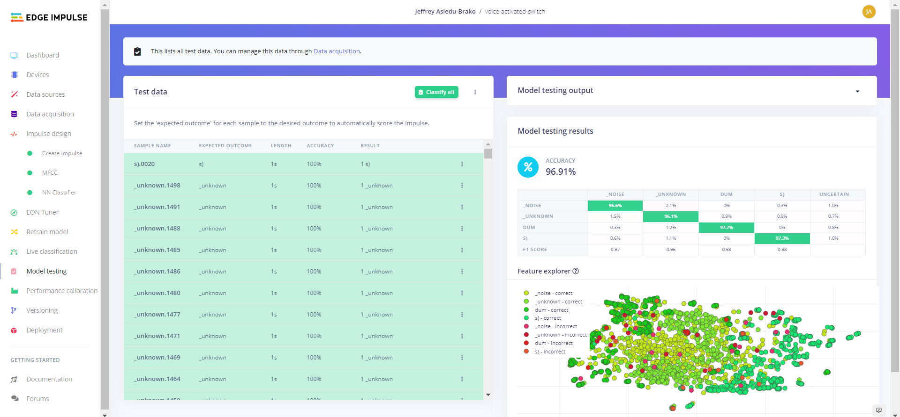
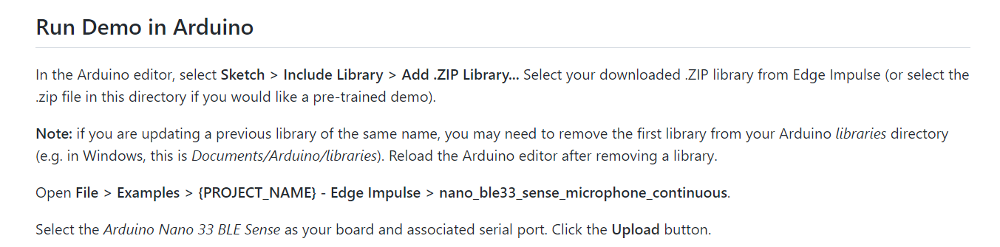
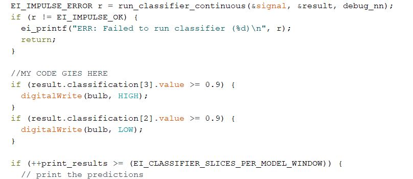

# Voice Controlled Lamp With Local Ghanaian Language (TWI) Using tinyML

The Voice Controlled Lamp is an experimental project built to explore and harness the power of tinyML. A machine learning model was trained on a 'good' number of audio data to recognize the local words: 'S)'- TWI equivalent of the English word 'ON' and 'DUM'- TWI equivalent of the English Word 'OFF'. When either of these words is detected, a lamp connected to the Arduino microcontroller is turned ON or OFF. 
It is a quite a challenge for some Ghanaians to interact with technology due to the fact that most technologies are built around English, even in basic forms. This 'mini' project can help people who speak TWI (and can even be extended to other Ghanaian languages) to interact with technology.

## Acknowledgements
I was inspired to work on this project after taking [@ShawnHymel's](https://github.com/ShawnHymel) course on Coursera: [Introduction to Embedded Machine Learning](https://coursera.org/share/4e592ef014e55f51cb7cbd029be1fa7a)

His repository, which can be found [here](https://github.com/ShawnHymel/ei-keyword-spotting) is a collection of tools and demo projects to get everyone started in creating their own embedded keyword spotting system using Machine Learning. 

***NOTE***:This repository should be downloaded and extracted onto your local machine, especially for performing data curation. 
I used it as a great reference material for my work.

## Authors

- Jeffrey Asiedu-Brako : [@ziegler121](https://www.github.com/ziegler121)

## Things used in this project
### Hardware Components
- [Arduino Nano 33 BLE Sense](https://docs.arduino.cc/hardware/nano-33-ble-sense/)
- Lamp
- 5V Relay
- Breadboard

### Software Apps and Online Services
- [Arduino IDE](https://www.arduino.cc/en/software)
- [Edge Impulse Studio](https://www.edgeimpulse.com/). This platform was basically utilized to Train a neural network to recognize the words of interest, test the model on some Test data and afterwards build the Model as an Arduino library ready to be deployed unto the Nano 33 BLE Sense board for inference.

## Methodology
1. ***Setting up Edge Impulse***: I began by creating my project on Edge Impulse ready for the next stage which is data collection
2. ***Data Collection and Curation***: There were two options for data collection
   - Connect the Arduino Nano 33 BLE Sense to Edge Impulse by following the instructions for its documentation page which can be found using [this link](https://docs.edgeimpulse.com/docs/development-platforms/officially-supported-mcu-targets/arduino-nano-33-ble-sense); and afterwards, collecting the audio data directly on Edge Impulse.
   - The other way, which I used, was to collect audio data locally using a recorder app on my mobile phone and afterwards upload that data on Edge Impulse to begin the Training Process. Normally, it is advised to collect data with the same device for which inference is going to be performed on; but for this project, it is totally okay to collect the audio samples with the mobile phone and still be able to perform accurate inference using the Arduino Nano 33 BLE Sense.
  
Since I wanted to control the turning on/off of a lamp with speech in the Ghanaian Language (Twi), I had to collect quite a reasonable amount of data for the words: ***S)*** and ***DUM***. ***S)*** is the equivalent of 'ON' in English while ***DUM*** is the equivalent of 'OFF'.

I got about 1 minute of audio data for each word from myself and other 4 people where we repeatedly said the word at 1-2 seconds intervals.
For this project (and many other keyword detection projects in the future), I relied on the Google Speech Commands dataset as a starting point for my keyword detection system. One may choose any word from the enormous list in the Google speech commands dataset as their keyword but since I wanted to use my local dialect, I had to record my own samples.
In recording my own samples, I followed the following guidelines:

After recording the audio samples, I utilized the [Audacity](https://www.audacityteam.org/) software to edit the audio and extract 1 second samples.

I stored my samples in a directory structure as shown below by following the instructions:

After getting my samples, the next task was to curate the dataset. That is, to combine my custom samples with the Google Speech Commands dataset, mix the samples with background noise and upload them on Edge Impulse. I achieved this by running a local Curation script on my laptop. I followed the guidelines given below:

The Google Speech Commands dataset can be downloaded using this [link](http://download.tensorflow.org/data/speech_commands_v0.02.tar.gz)

After running the script, I uploaded the curated/mixed audio files onto the Edge Impulse platform.

I then rebalanced the dataset to have the recommended 80-20 split for Training and Test data.

3. ***Training The Model***: By clicking the ‘Start Training’ button, the model was trained in Edge Impulse and when done, the resulting Confusion Matrix and Accuracy metrics were shown.

4. ***Testing and Deployment***: After successfully training the model, the next stage was to head to ‘Model Testing’ on Edge Impulse to test the performance of this newly trained Neural Network on test samples, which were not used in training.

Next was to click the ‘Deployment’ link on the left pane, click the ‘Arduino Library option’ and finally click ‘Build’ to download the .zip file containing my model and everything I need to perform real live inference.

5. ***Load Machine Learning Model in Embedded Project and Test***:The model is included as a library in the Arduino IDE. The code is then compiled and flashed the code to the Nano

To run the code, the following steps can be followed:

By running this code and opening the Serial monitor, you would see the various predictions being printed to the screen. When you try saying one of the keywords, the prediction output (that is, the probability that the model thinks it heard that word/phrase) goes up

## Modifying the Demo Program to Suit One's Use-case
Any code for any particular actuation or action that the developer wants to be done while the prediction algorithm is running should be placed at the section shown in the screenshot below. 
In my particular instance, I look for a prediction value of 0.9 or above (Note that the value 0.9 can be modified depending on how precise the predictions must be) for any of the keywords. If that happens, the Lamp is controlled accordinngly.

A brief demonstration of the project is show below:

## Results and Conclusion
The project worked quite well in detecting the keywords ‘s)’ and ‘dum’ for turning on and off the LED(lamp). 
The major downside with the model I trained was that it was finding some difficulty detecting the keywords when other people tested it using their voice. 
This is because I introduced some bias when training my model by feeding it with audio samples that had a major constitution of my voice. So the model works well with my voice and a few other people but when tested on other voices, it performed quite poorly. 

In order to make the model work almost perfectly even with different voices, one potential fix will be to collect much more data from a diverse group of people and retrain the Model to be able to recognize the keywords despite the vocal diversity it may be given as input.
